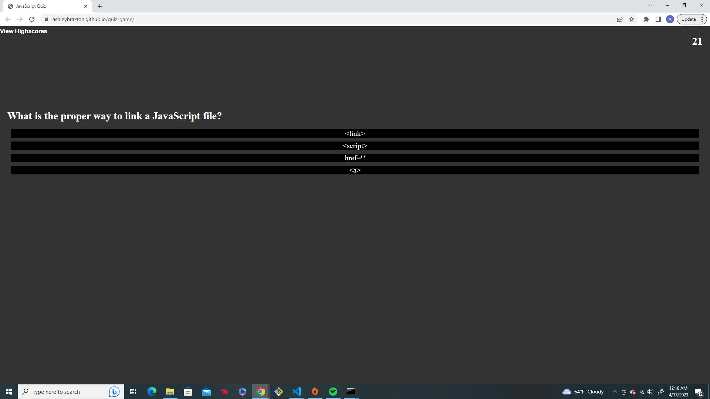

# quiz-game
## Description
This is a timed quiz on basic Javascript conscepts. It allows a user to test their knowledge and then save their score to be put on a highscore page for comparison to other users scores.

## Installation
N/A
## Usage
Upon loading the page, the user will be presented with the description of the quiz letting them know that it will be on javascript basics, it is timed and incorrect answers will result in a time penalty. they click the start button and the timer will start and a question will be generated. The user will read the question before selecting the answer they belive is correct. A message below the questions will let them know if they were correct or not, if they were wrong, 5 seconds will be removed from the quiz timer. If they run out of time the game is stopped immediately. Upon finishing the quiz they are presented their score and propted to add their initials so that they may be added to the highscore list. They will then be shown the highscore page where all current highscores are listed. they will have the ability to go back to the start page, or clear out the saved highscores.
webpage can be accessed here:
 https://ashleybraxton.github.io/quiz-game/

## Resources 
The button design for the start,submit,clear scores, and return buttons wasfound on https://dev.to/gscode/20-css-buttons-4cni, the code came from that website and is not my own.
## License

MIT